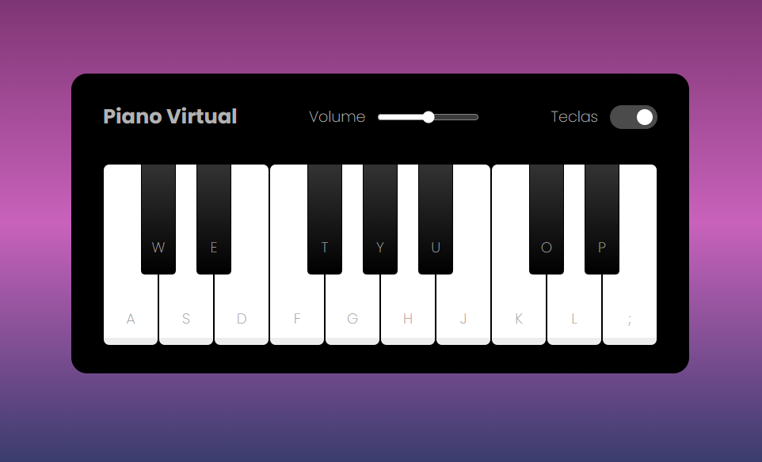

# Piano Simulator 🎹

Este é um projeto desenvolvido como parte de um desafio em um bootcamp. Ele fornece uma interface interativa que permite ao usuário simular a execução de notas musicais como em um piano real, tanto através do teclado quanto clicando na interface.

   

### ⚙ Tecnologias Utilizadas

- HTML5 e CSS3 para a estrutura e aparência.
- JavaScript para a lógica de programação e interatividade.

### ✔️ Funcionalidades 

- **Reprodução de Notas**: Ao clicar em uma tecla do piano na interface, ou pressionar a tecla correspondente no teclado, o simulador reproduz o som da nota musical associada aquela tecla.
- **Controle de Volume**: Um controle deslizante (slider) permite ajustar o volume do som reproduzido pelo simulador.
- **Mostrar / Ocultar Teclas**: Um botão de alternância na interface permite mostrar ou ocultar as teclas do piano, proporcionando uma experiência personalizável ao usuário.

### 🕹️ Como tocar ?

1. Clone este repositório para sua máquina local.
2. Abra o arquivo `index.html` em seu navegador web.
3. Divirta-se tocando suas músicas favoritas!
5. Ou, [Clique aqui] (https://mari4souza.github.io/piano-simulator/).

### 💡 Diferenciais em relação ao projeto original

- Foi adicionado o Favicon para personalização da janela/aba do site.
- Reorganização das notas do piano de forma correta, respeitando os tons e semitons.

### 📝 Créditos

Este jogo foi desenvolvido como parte de um projeto educacional da Digital Innovation One.
